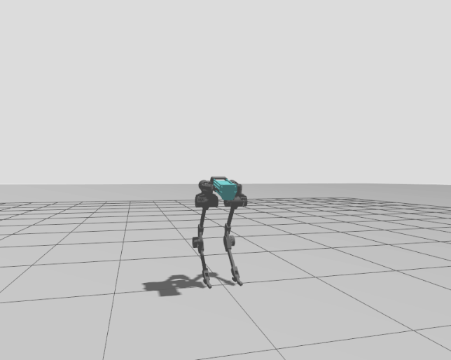

# BlackBird Walking

this project is dedicated to creating a reinforcement learning environment (see: `gz_blackbird`) in order to create a policy to make the blackbird bipedal robot walk in a Gazebo enviornment using `ros2_control` as the middleware.



see the separate directory descriptions below:

### gz_blackbird
This is the training environment developed with Gazebo Harmonic.
Written in C++, it features a python API for the gym enviornments. Please see `BalanceEnv.py` for a static balance environment, and `BlackbirdEnv.py` for the walking environment.


### ai_model
this is where the AI models are developed and training is run in. try `train_balance.py` or `test_balance.py` to test the model

### realtime_ws
this is the ros2 workspace dedicated for the test environment. see `PosePublisher.cpp` to see the topic created to publish the robot's state. Make sure `gz_ros2_control` is installed by running the following command:

```
sudo apt install ros-jazzy-gz-ros2-control
```
