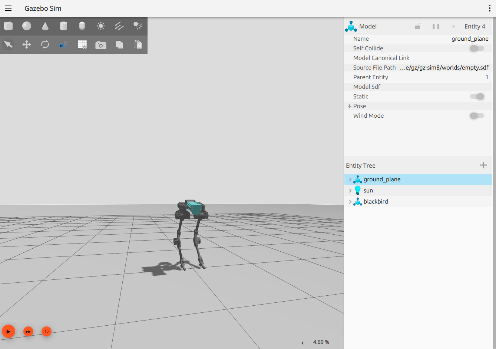

# Blackbird Simulation with Gazebo Harmonic

Gazebo Simulation of the blackbird bipedal robot, as seen [here](https://hackaday.io/project/160882-blackbird-bipedal-robot)

Utilizes ROS2 as the robot's middleware, with `ros2_control` for the joint controllers

####  Dependencies

```
ros2 jazzy (works on humble aswell)
ros2_control
gz_ros2_control
Gazebo Harmonic
```

## Rviz

please run `ros2 launch blackbird_ros2 blackbird_rviz.launch.py` 

## Gazebo simulation
Please run `export GZ_SIM_RESOURCE_PATH=<ROS2 WORKSPACE PATH>/src/blackbird_ros2`

*Example:* `export GZ_SIM_RESOURCE_PATH=~/ros2_ws/src/blackbird_ros2`

then run from your workspace directory: 
`ros2 launch blackbird_ros2 blackbird_gz.launch.py`

For the torso_pose topic, don't forget

`export GZ_SIM_SYSTEM_PLUGIN_PATH=~/ros2_ws/install/blackbird_ros2/lib/blackbird_ros2`

or you won't be able to get the PosePublisher topic

## Extra topics

### PosePublisher
Extract pose information from the blackbird entity,
as calculated in the Gazebo simulation. it is returned in
the form of a Float64MultiArray



#### Testing Controllers

run either `ros2 run blackbird_ros2 effort_example` 
or `ros2 run blackbird_ros2 reverse_effort`

## Future Work

Develop a control policy that takes in information from the `/torso_pose` topic,
